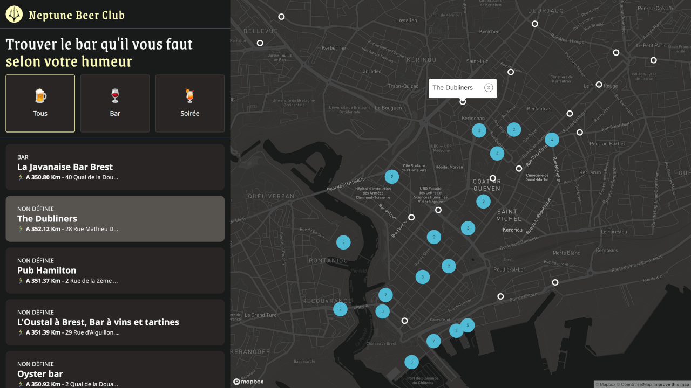

# Neptune Beer Club

[](https://nodejs.org/)
[](https://vitejs.dev/)
[](https://www.typescriptlang.org/)
[](https://reactjs.org/)
[](https://tailwindcss.com/)
[](https://visgl.github.io/react-map-gl/)

Dans le cadre de la compagne de recrutement de l'agence [Lumy](https://lumy.bzh/), un projet optionnel est proposé aux candidats. En 4j, je développe une application web pour trouver les bars à Brest 🍺. Les critères sont basés entre autres sur le déploiement, le système de filtrage et l'originalité.

Mission acceptée ! 💪

## Démo

👉 https://jeromeabel.github.io/neptunebeerclub/



## Conception

### stratégie

Comme le temps est court, l'idée est de conceptualiser rapidement les besoins prioritaires et d'évaluer la faisabilité des choix techniques selon les critères du recruteur. Aussi, les nouveautés techniques ne devraient pas dépasser les 50% du projet pour pouvoir le réaliser dans les temps.

### Concept

Le concept derrière le projet **Neptune Beer Club** consiste à donner une identité de légendes, charismatique, autour des bars de Brest.

### Use Cases

- Naviguer à la main sur la carte de Brest
- Afficher les bars sur la carte
- Voir la liste des bars
- Sélectionner un bar
- Voir les détails d'un bar
- Filtrer les bars

## Architecture

1. Single Page Application (SPA) avec la librairie React, Vite et Tailwind.
2. Configuration : Vite, Vitest, Prettier, EsLint, TypeScript
3. Organisation des fichiers : Screaming architecture avec un dossier features/bar
4. Déploiement : GitHub Actions

## Déploiement :

- Deux branches : main et develop (`git checkout -b develop`)
- Git pages : à partir d'une Git Action
- Git actions avec quatre types de jobs : tests, build, lint/check format, deploy
  - Quand une Pull Request est demandée sur la branche "develop", le projet est testé
  - Si aucunes erreurs, il peut alors être fusionné à la branche main et déployé
- Branch protection rules (main)

```
- [x] Require a pull request before merging
	- [ ] Require approvals (pas besoin ici)
- [ ] Require status checks to pass before merging
	- [x] Require branches to be up to date before merging : Build-and-test GitHub Actions
- [x] Do not allow bypassing the above settings
```

## SETUP

### Vite, React, TS

```sh
npm create vite@latest neptunebeerclub -- --template react-ts
```

### Git Remote

```sh
git remote add origin git@github.com:jeromeabel/neptunebeerclub.git
git branch -M main
git push -u origin main
```

Deploy Base Site

```ts
//vite.config.ts
export default defineConfig({
  plugins: [react()],
  base: '/neptunebeerclub', // repo
  //...
])
```

### Expanding ESLint Recommandations

```sh
npm install -D eslint-plugin-react
```

```js
// Vite Recommandations
//.eslintrc.cjs
export default {
  //...
  extends: [
    'eslint:recommended',
    'plugin:@typescript-eslint/recommended-type-checked',
    'plugin:react-hooks/recommended',
    'plugin:react/recommended',
    'plugin:react/jsx-runtime',
  ],
  // other rules...
  parserOptions: {
    ecmaVersion: 'latest',
    sourceType: 'module',
    project: ['./tsconfig.json', './tsconfig.node.json'],
    tsconfigRootDir: __dirname,
  },
};
```

### Prettier

Installation de Prettier et du plugin Tailwind pour le réarrangement des classes (auto-sorting)

```shell
npm install -D prettier prettier-plugin-tailwindcss
```

```json
// .prettierrc
{
  "printWidth": 100,
  "tabWidth": 2,
  "useTabs": false,
  "semi": true,
  "singleQuote": true,
  "trailingComma": "all",
  "bracketSpacing": true,
  "bracketSameLine": false,
  "plugins": ["prettier-plugin-tailwindcss"]
}
```

```json
//package.json
"scripts": {
	//...
	"format:check": "prettier . --check --ignore-path .gitignore",
  "format:fix": "prettier . --write"
}
```

### Vitest

```bash
npm install -D vitest happy-dom @testing-library/react @testing-library/jest-dom @testing-library/user-event
```

```json
"scripts": {
	//...
	"test": "vitest",
	"coverage": "vitest run --coverage"
}
```

Dans vite.config, changer le defineConfig et ajouter le setup files et l'environnement DOM de test

```ts
//vite.config.ts
import { defineConfig } from 'vitest/config';

export default defineConfig({
	// ...
  test: {
    globals: true,
    environment: 'happy-dom',
    setupFiles: ['./vitest.setup.ts'],
  },
  //...
```

```ts
//vitest.setup.ts
import '@testing-library/jest-dom';
```

### TypeScript aliases

Add compilerOptions and paths to the TS config file:

```ts
//ts.config.json
{
  "extends": "astro/tsconfigs/strict",
  "compilerOptions": {
    // ...
    "baseUrl": ".",
    "paths": {
      "@assets/*": ["src/assets/*"],
      "@components/*": ["src/ui/components/*"],
      "@containers/*": ["src/ui/containers/*"],
      "@layouts/*": ["src/ui/layouts/*"],
      "@features/*": ["src/features/*"],
      "@pages/*": ["src/pages/*"],
      "@styles/*": ["src/styles/*"]
    }
  }
}
```

Ajouter les chemins aussi dans vite.config

```js
// vite.congig.ts
import path from 'path';
//...

export default defineConfig({
  //...
  resolve: {
    alias: {
      '@': path.resolve(__dirname, './src'),
      '@assets': path.resolve(__dirname, './src/assets'),
      '@components': path.resolve(__dirname, './src/ui/components'),
      '@containers': path.resolve(__dirname, './src/ui/containers'),
      '@layouts': path.resolve(__dirname, './src/ui/layouts'),
      '@features': path.resolve(__dirname, './src/features'),
      '@pages': path.resolve(__dirname, './src/pages'),
      '@styles': path.resolve(__dirname, './src/styles'),
    },
  },
});
```

### Tailwind

Optionnel : ajout du package "clsx"

```sh
npm install -D tailwindcss postcss autoprefixer
npx tailwindcss init -p
npm install -D prettier prettier-plugin-tailwindcss
```

```js
//tailwind.config.js
export default {
  content: ['./index.html', './src/**/*.{js,ts,jsx,tsx}'], // à ajouter
};
```

Ajouter le plugin à prettier si ce n'est pas déjà fait :

```js
// .prettierrc
"plugins": ["prettier-plugin-tailwindcss"]
```

Directives Tailwind

```css
/* src/styles/index.css */
@tailwind base;
@tailwind components;
@tailwind utilities;
```

Importation des styles dans le fichier principal

```tsx
// main.tsx
import React from 'react';
import ReactDOM from 'react-dom/client';
import { Home } from '@pages/home';
import '@styles/index.css'; // Ajouté

ReactDOM.createRoot(document.getElementById('root')!).render(
  <React.StrictMode>
    <Home />
  </React.StrictMode>,
);
```

## Screaming architecture

Référence: [React Folder Structure](https://profy.dev/article/react-folder-structure)

J'ai essayé d'implémenter ces caractéristiques :

- index.js as a public API
- camel-case
- features & colocation

```
└── src/
		├── assets/
    ├── features/
    │   ├── bars/
    │   │   ├── index.js (public API)
	  │   │   ├── api/index.ts
    │   │   ├── bar-map/
    │   │   ├── bar-form/
    │   │   └── bar-list/
    │   │       ├── index.js (public API)
    │   │       ├── bar-item.component.js
    │   │       ├── bar-list.component.js
    │   │       ├── bar-list.context.js
    │   │       ├── bar-list.test.js
    │   │       └── use-bar-list.js
    │   └── users/ (new features, not yet)
    │       ├── index.js
    │       ├── login/
    │       ├── signup/
    │       └── use-auth.js
		├── ui/ (common, shared components)
    │   ├── index.js
    │   ├── components/
    │   ├── containers/ : header, footer, navbar, ...
    │   └── layouts/
    └── pages/
        └── home.tsx
```

## Prochaines améliorations

### Secondaires

- Rechercher un bar (+ autour de moi)
- Obtenir des itinéraires
- Partager l'emplacement
- Ajouter un bar
- Laisser des avis
- Connaitre les bars ouverts
- Carte des boissons
- Réserver des boissons (+estimation du coût de la soirée)

### Techniques

- Gestion des données via API Directus
- Docker : fly.io, Vercel
- StoryBook pour tester les composants
- GSAP ou Framer-motion pour ajouter des animations

### Idées

- NetpuneBeerClub - Dieu des bars et de la bière, Label des bars
- Bars indépendants, bières locales
- Accompagnements : pas de poissons, c'est un piège
- Marée, glou glou
- IA Bot (poisson ?) Bot Fish
- 3D Flou, Vague, bouge
- Ajouter un S.A.M.
- Accepte les animaux
- Gay friendly
- Accès Handicapés, ...
- Prises électriques (pour les robots)

### Acteurs

- Scénario classique, choix entre trois modes
  - Couple ou Brasseur/connaisseur
  - Amis
  - Affaires
- Scénario originale :
  - Chien
  - Robot
  - Humain dans le futur
